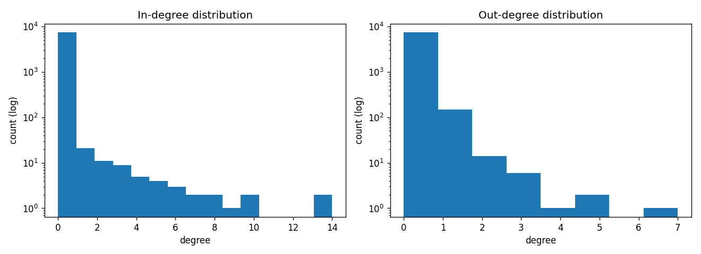

# Legal-AI: Citation Network Analysis of Indian Supreme Court Land & Property Dispute Cases (1950-2024)

## Overview

This project builds and analyzes a **directed citation graph** from 7,496 Indian Supreme Court land and property dispute judgments spanning 1950 to 2024. Case metadata and judgment links are sourced from [Indian Kanoon](https://indiankanoon.org), and citations between cases are extracted via web scraping to construct a network that reveals how judicial precedent flows through decades of property law.

## Findings Summary

### Dataset
- **7,496 unique cases** across 75 years (1950-2024), sourced from Indian Kanoon
- Cases distributed fairly evenly across decades, peaking in the 2010s (1,254 cases)
- Every case has a unique Indian Kanoon doc ID and a corresponding judgment URL

### Citation Graph (100-case run)
- **215 intra-corpus citation edges** extracted from 100 seed cases
- **2,298 total raw out-citations** (including references to cases outside the corpus)
- **Largest connected component: 100 nodes** (1.3% of graph) — already a cohesive subnetwork from just 1.3% of the corpus
- Graph density ~0.000004, consistent with legal citation networks where landmark cases accumulate citations while most cases cite only a few predecessors

### Most-Cited Cases (in-degree)
| Rank | Case | Year | In-degree |
|---|---|---|---|
| 1 | A.K. Gopalan v. State of Madras | 1950 | 14 |
| 2 | State of Bihar v. Maharajadhiraja Sir Kameshwar Singh | 1952 | 14 |
| 3 | Ram Singh v. State of Delhi | 1951 | 10 |
| 4 | Visweshwar Rao v. State of Madhya Pradesh | 1952 | 10 |
| 5 | State of Bombay v. F.N. Balsara | 1951 | 8 |

### Most-Citing Cases (out-degree)
| Rank | Case | Year | Out-degree |
|---|---|---|---|
| 1 | Kesavananda Bharati v. State of Kerala | 1973 | 7 |
| 2 | I.C. Golak Nath v. State of Punjab | 1967 | 5 |
| 3 | ADM Jabalpur v. S.S. Shukla | 1976 | 4 |
| 4 | Maneka Gandhi v. Union of India | 1978 | 3 |

### Key Observations
1. **Power-law degree distribution**: Both in-degree and out-degree follow heavy-tailed distributions on a log scale. A handful of landmark cases attract the vast majority of citations, while most cases have degree 0-1.
2. **Foundational 1950s cases dominate in-degree**: The top citation targets are all from 1950-1952, the earliest years of the Supreme Court. These cases established constitutional precedent on property rights (Art. 19, 31) and due process (Art. 21, 22) that later cases built upon.
3. **Landmark "synthesizer" cases dominate out-degree**: The top citing cases are well-known constitutional law landmarks (*Kesavananda Bharati*, *Golak Nath*, *ADM Jabalpur*, *Maneka Gandhi*) that surveyed and consolidated decades of prior precedent.
4. **Temporal citation asymmetry**: Citations flow strictly forward in time (later cases cite earlier ones), producing a DAG structure consistent with legal stare decisis.
5. **HTML scraping challenge solved**: Indian Kanoon judgment pages embed `/doc/` links to statutes and constitutional articles, not to other case judgments. The scraper was redesigned to use IK's search-result pages (`/search/?formInput=citedby:<id>`) which correctly separate case-to-case citations from statute references.

### Degree Distribution



### Scaling Estimate
At the observed rate (~2.15 intra-corpus edges per case), a full 7,496-case run would yield an estimated **16,000+ intra-corpus edges**, producing a dense citation network suitable for community detection, PageRank-based importance scoring, and temporal analysis of how property law doctrine evolves.

## Project Structure

```
Legal-AI/
  extract_citations.py        # Citation extraction pipeline (API + HTML scraper)
  build_graph.py               # Graph construction, stats, and visualization
  land_property_dispute_cases.csv  # Source dataset (7,496 cases)
  data/
    nodes.csv                  # Graph nodes (id, case, year)
    edges.csv                  # Intra-corpus citation edges
    out_citations_raw.csv      # All observed citations (including external)
    report.md                  # Auto-generated graph summary
    degree_dist.png            # In/out-degree distribution plot
```

## Usage

### Extract citations

```bash
# HTML scraper (no API key needed)
python extract_citations.py --limit 50 --max-pages 3 --rate 1.0

# With Indian Kanoon API key (faster, more complete)
export INDIANKANOON_API_TOKEN=your_token
python extract_citations.py --limit 0
```

Key flags:
- `--limit N`: number of cases to process (0 = all 7,496)
- `--max-pages N`: search result pages per direction per case (HTML mode; 10 results/page)
- `--rate`: seconds between requests (be polite to IK servers)
- `--force`: ignore cache and refetch

All responses are cached to `cache/`, so runs are fully resumable.

### Build the graph

```bash
python build_graph.py --outdir data
```

Reads `data/nodes.csv` and `data/edges.csv`, writes `data/report.md` and `data/degree_dist.png`.

## Data Source

- **Indian Kanoon** (https://indiankanoon.org) - open-access Indian legal database
- The input CSV was compiled by filtering Supreme Court judgments related to land and property disputes

## Requirements

```
python >= 3.9
requests
beautifulsoup4
networkx
matplotlib
pandas  # for exploratory analysis only
```

## Next Steps

- Run full corpus extraction (7,496 cases) with higher `--max-pages` for completeness
- Apply community detection (Louvain / label propagation) to identify clusters of related property law doctrine
- Compute PageRank / HITS to rank case importance beyond simple citation count
- Temporal analysis of citation patterns across decades
- Cross-reference with the Google Drive judgment PDFs for full-text NLP analysis
